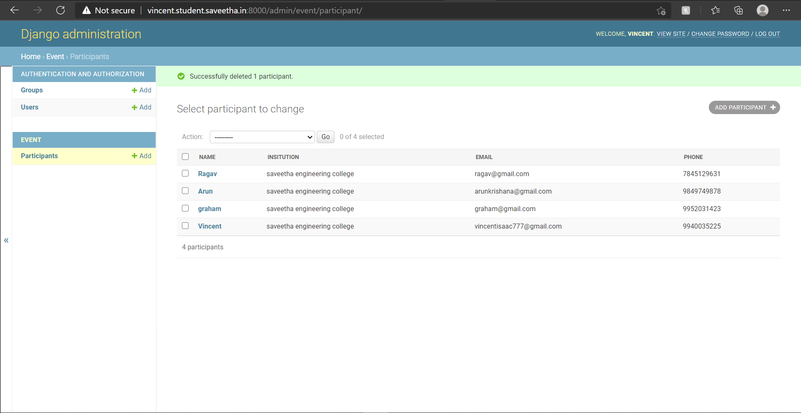

# WebApplication for Event Registration

## AIM:
To create a UX design and develop a web application for event registration.
## DESIGN STEPS:


## DESIGN SCREENS:


## WIREFRAME:


## PROTOTYPE:


## PROGRAM:

### HOME.HTMML:
```
<!doctype html>
<html lang="en">

<head>
    <!-- Required meta tags -->
    <meta charset="utf-8">
    <meta name="viewport" content="width=device-width, initial-scale=1, shrink-to-fit=no">

    <!-- Bootstrap CSS -->
    <link rel="stylesheet" href="https://maxcdn.bootstrapcdn.com/bootstrap/4.0.0/css/bootstrap.min.css"
        integrity="sha384-Gn5384xqQ1aoWXA+058RXPxPg6fy4IWvTNh0E263XmFcJlSAwiGgFAW/dAiS6JXm" crossorigin="anonymous">

    <title>Gamers point</title>
</head>

<body>
    <div class="jumbotron jumbotron" style="background-color:black;">
        <div class="container  text-center">
            <div class="card col-12 col-md-6 col-lg-6"></div>
            
            <h1 style="color:rgb(171, 221, 219);">GAMERS POINT</h1>
        </div>
    </div>

    <div class="container text-center">
        <div class="row">
            <div class="card col-12 col-md-6 col-lg-6">
                
            </div>

            <div class="col-6">
                <h1 class="text-right">Gaming con</h1>
                <h1 class="text-right">Saveetha engineering college</h1>
                <h1 class="text-right">9:00 am - 8:00pm</h1>
                <h1 class="text-right">29.11.2021</h1>
            </div>
        </div>
    </div>
    <div class="container">
        <div class="row">
            <div class="col-12 text-right">
                <a href="/register/" class="btn btn-primary btn-lg" role="button">Compete</a>
            </div>
        </div>
    </div>

    <!-- Optional JavaScript -->
    <!-- jQuery first, then Popper.js, then Bootstrap JS -->
    <script src="https://code.jquery.com/jquery-3.2.1.slim.min.js"
        integrity="sha384-KJ3o2DKtIkvYIK3UENzmM7KCkRr/rE9/Qpg6aAZGJwFDMVNA/GpGFF93hXpG5KkN"
        crossorigin="anonymous"></script>
    <script src="https://cdnjs.cloudflare.com/ajax/libs/popper.js/1.12.9/umd/popper.min.js"
        integrity="sha384-ApNbgh9B+Y1QKtv3Rn7W3mgPxhU9K/ScQsAP7hUibX39j7fakFPskvXusvfa0b4Q"
        crossorigin="anonymous"></script>
    <script src="https://maxcdn.bootstrapcdn.com/bootstrap/4.0.0/js/bootstrap.min.js"
        integrity="sha384-JZR6Spejh4U02d8jOt6vLEHfe/JQGiRRSQQxSfFWpi1MquVdAyjUar5+76PVCmYl"
        crossorigin="anonymous"></script>
</body>

</html>
```

### REGISTER.HTML:
```
<!doctype html>
<html lang="en">

<head>
    <!-- Required meta tags -->
    <meta charset="utf-8">
    <meta name="viewport" content="width=device-width, initial-scale=1, shrink-to-fit=no">

    <!-- Bootstrap CSS -->
    <link rel="stylesheet" href="https://stackpath.bootstrapcdn.com/bootstrap/4.1.3/css/bootstrap.min.css"
        integrity="sha384-MCw98/SFnGE8fJT3GXwEOngsV7Zt27NXFoaoApmYm81iuXoPkFOJwJ8ERdknLPMO" crossorigin="anonymous">
 
     <title>Gamers point</title>
</head>

<body>
    <div class="jumbotron jumbotron-fluid" style="background-color:black;">
        <div class="container  text-center">
            <div class="card col-12 col-md-6 col-lg-6"></div>
            
            <h1 style="color: rgb(196, 186, 49);">Gamers point</h1>
        </div>
    <form action="/register/" method="POST">
        
        <div class="container display-4 text-left" style="color: rgb(196, 186, 49);" >
        <div class="form-group">
            <label for="username">NAME</label>
            <input type="text" class="form-control" id="username" name="username" placeholder="Enter your name">
        </div>
        <div class="form-group">
            <label for="phone">Contact No</label>
            <input type="text" class="form-control" id="phone" name="phone" placeholder="Enter your Phone.no">
        </div>
        <div class="form-group">
            <label for="email">E-mail id</label>
            <input type="email" class="form-control" id="email" name="email" placeholder="name@example.com">
        </div>
        <div class="form-group">
            <label for="Institution">Institution</label>
            <input type="text" class="form-control" id="Institution" name="institution" placeholder="Institution name">
        </div>
        <div class="col-12 text-center">
              <button type="submit" class="btn btn-primary btn-lg">Join</button>
              <a href="/home/"class="btn btn-primary btn-lg" role="button" aria-pressed="true">Decline</a>
        </div>
    </div>
    </form>

    <!-- Optional JavaScript -->
    <!-- jQuery first, then Popper.js, then Bootstrap JS -->
    <script src="https://code.jquery.com/jquery-3.3.1.slim.min.js"
        integrity="sha384-q8i/X+965DzO0rT7abK41JStQIAqVgRVzpbzo5smXKp4YfRvH+8abtTE1Pi6jizo"
        crossorigin="anonymous"></script>
    <script src="https://cdnjs.cloudflare.com/ajax/libs/popper.js/1.14.3/umd/popper.min.js"
        integrity="sha384-ZMP7rVo3mIykV+2+9J3UJ46jBk0WLaUAdn689aCwoqbBJiSnjAK/l8WvCWPIPm49"
        crossorigin="anonymous"></script>
    <script src="https://stackpath.bootstrapcdn.com/bootstrap/4.1.3/js/bootstrap.min.js"
        integrity="sha384-ChfqqxuZUCnJSK3+MXmPNIyE6ZbWh2IMqE241rYiqJxyMiZ6OW/JmZQ5stwEULTy"
        crossorigin="anonymous"></script>
</body>

</html>
```

### SUCESS.HTML:
```
<!doctype html>
<html lang="en">

<head>
    <!-- Required meta tags -->
    <meta charset="utf-8">
    <meta name="viewport" content="width=device-width, initial-scale=1, shrink-to-fit=no">

    <!-- Bootstrap CSS -->
    <link rel="stylesheet" href="https://stackpath.bootstrapcdn.com/bootstrap/4.1.3/css/bootstrap.min.css"
        integrity="sha384-MCw98/SFnGE8fJT3GXwEOngsV7Zt27NXFoaoApmYm81iuXoPkFOJwJ8ERdknLPMO" crossorigin="anonymous" style="color: rgb(0, 0, 0);">

    <title>GMAERS POINT</title>
</head>

<body>
    <div class="jumbotron" style="background-color: black;">
        <div class="p-5 text-center">
      
        <div class="container">
        <h1 class="display-8 text-center" style=color:rgb(80,184,12) font-style=helvetica>GMAERS POINT</h1>
        </div>
    </div>
        
        <div class="row">
            <div class="col-12">
                <h1 class="text-center" style=color:rgb(80,184,12)>You Have Joined The Battle</h1>
            </div>
        </div>
        <div class="row">
            <div class="col-12 text-center">
                <a href="/home/"class="btn btn-primary btn-lg" role="button" aria-pressed="true">Return Back</a>
            </div>
        </div>
    </div>

    <!-- Optional JavaScript -->
    <!-- jQuery first, then Popper.js, then Bootstrap JS -->
    <script src="https://code.jquery.com/jquery-3.3.1.slim.min.js"
        integrity="sha384-q8i/X+965DzO0rT7abK41JStQIAqVgRVzpbzo5smXKp4YfRvH+8abtTE1Pi6jizo"
        crossorigin="anonymous"></script>
    <script src="https://cdnjs.cloudflare.com/ajax/libs/popper.js/1.14.3/umd/popper.min.js"
        integrity="sha384-ZMP7rVo3mIykV+2+9J3UJ46jBk0WLaUAdn689aCwoqbBJiSnjAK/l8WvCWPIPm49"
        crossorigin="anonymous"></script>
    <script src="https://stackpath.bootstrapcdn.com/bootstrap/4.1.3/js/bootstrap.min.js"
        integrity="sha384-ChfqqxuZUCnJSK3+MXmPNIyE6ZbWh2IMqE241rYiqJxyMiZ6OW/JmZQ5stwEULTy"
        crossorigin="anonymous"></script>
</body>

</html>
```

### FAILED.HTML:
```
<!doctype html>
<html lang="en">

<head>
    <!-- Required meta tags -->
    <meta charset="utf-8">
    <meta name="viewport" content="width=device-width, initial-scale=1, shrink-to-fit=no">

    <!-- Bootstrap CSS -->
    <link rel="stylesheet" href="https://stackpath.bootstrapcdn.com/bootstrap/4.1.3/css/bootstrap.min.css"
        integrity="sha384-MCw98/SFnGE8fJT3GXwEOngsV7Zt27NXFoaoApmYm81iuXoPkFOJwJ8ERdknLPMO" crossorigin="anonymous" style="color: rgb(0, 0, 0);">

    <title>GMAERS POINT</title>
</head>

<body>
    <div class="jumbotron" style="background-color: black;">
        <div class="p-5 text-center">
      
        <div class="container">
        <h1 class="display-8 text-center" style=color:rgb(102,189,81) font-style=helvetica>GMAERS POINT</h1>
        </div>
    </div>
        
        <div class="row">
            <div class="col-12">
                <h1 class="text-center" style=color:rgb(102,189,81)>You Have Failed Joined The Battle</h1>
            </div>
        </div>
        <div class="row">
            <div class="col-12 text-center">
                <a href="/home/"class="btn btn-primary btn-lg" role="button" aria-pressed="true">Return Back</a>
            </div>
        </div>
    </div>

    <!-- Optional JavaScript -->
    <!-- jQuery first, then Popper.js, then Bootstrap JS -->
    <script src="https://code.jquery.com/jquery-3.3.1.slim.min.js"
        integrity="sha384-q8i/X+965DzO0rT7abK41JStQIAqVgRVzpbzo5smXKp4YfRvH+8abtTE1Pi6jizo"
        crossorigin="anonymous"></script>
    <script src="https://cdnjs.cloudflare.com/ajax/libs/popper.js/1.14.3/umd/popper.min.js"
        integrity="sha384-ZMP7rVo3mIykV+2+9J3UJ46jBk0WLaUAdn689aCwoqbBJiSnjAK/l8WvCWPIPm49"
        crossorigin="anonymous"></script>
    <script src="https://stackpath.bootstrapcdn.com/bootstrap/4.1.3/js/bootstrap.min.js"
        integrity="sha384-ChfqqxuZUCnJSK3+MXmPNIyE6ZbWh2IMqE241rYiqJxyMiZ6OW/JmZQ5stwEULTy"
        crossorigin="anonymous"></script>
</body>

</html>
```

### ADMIN.PY:
```
from django.contrib import admin
from .models import participant,participantAdmin
# Register your models here.

admin.site.register(participant,participantAdmin)
```

### MODELS.PY:
```
from django.db import models
from django.contrib import admin
# Create your models here.
class participant(models.Model):
    name = models.CharField(max_length=100)
    insitution = models.CharField(max_length=100)
    email = models.CharField(max_length=50)
    phone = models.CharField(max_length=50)
    
    
class participantAdmin(admin.ModelAdmin):
    list_display = ('name', 'insitution', 'email','phone')
```

### VIEWS.PY:
```
from django.shortcuts import render
from .models import participant
from django.core.exceptions import ValidationError

# Create your views here.
def home(request):
    context = {}
    return render(request, 'event/home.html', context)

def register(request):
    context = {}

    if request.method == 'POST':
        p1=participant()
        p1.name = request.POST.get('username','-')
        p1.email = request.POST.get('email','-')
        p1.phone = request.POST.get('phone','000')
        p1.insitution = request.POST.get('insitution','-')

        if len(participant.objects.all()) > 5 :
            
            return render (request, 'event/failed.html',context)

        else:
            p1.save()
            return render (request, 'event/success.html',context)

    if request.method == 'GET':
        context['username'] = ''
        context['email'] = ''
        context['phone'] = ''
        context['insitution'] = ''

    return render(request, 'event/register.html', context)

def listofparticipants(request):
    context = {}
    context['participant'] = participant.objects.all()
    return render(request, 'event/listofparticipants.html', context)
```

### URLS.PY:
```
"""eventregistration URL Configuration

The `urlpatterns` list routes URLs to views. For more information please see:
    https://docs.djangoproject.com/en/3.1/topics/http/urls/
Examples:
Function views
    1. Add an import:  from my_app import views
    2. Add a URL to urlpatterns:  path('', views.home, name='home')
Class-based views
    1. Add an import:  from other_app.views import Home
    2. Add a URL to urlpatterns:  path('', Home.as_view(), name='home')
Including another URLconf
    1. Import the include() function: from django.urls import include, path
    2. Add a URL to urlpatterns:  path('blog/', include('blog.urls'))
"""
from django.contrib import admin
from django.urls import path
from event import views

urlpatterns = [
    path('admin/', admin.site.urls),
    path('home/', views.home , name='home'),
    path('register/',views.register,name="register"),
    path('listofparticipants/', views.listofparticipants , name='listofparticipants'),
 ]

```

## OUTPUT:





## RESULT:
Thus, a UX design and develop a web application for event registration has been done and
the hostred URL http://vincent.student.saveetha.in:8000/home/.

